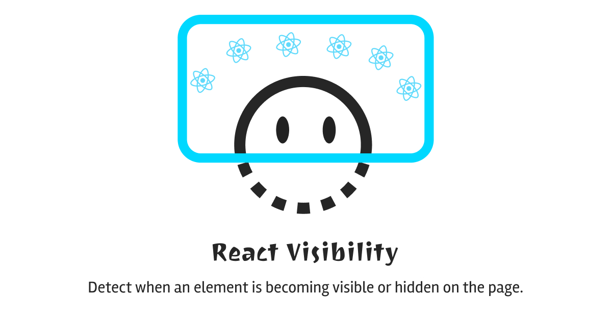

# React Visibility

Detect when an element is becoming visible or hidden on the page.

<div align="center">
    
</div>


[](https://www.npmjs.com/package/reactjs-visibility)
[](https://github.com/kingrayhan/reactjs-visibility/blob/master/LICENSE)

### Installation

```bash
npm install reactjs-visibility
```

> ⚠️ This plugin uses the Intersection Observer API that is not supported in every browser (currently supported in Edge, Firefox and Chrome). You need to include a polyfill to make it work on incompatible browsers.

### Detech visibility with `<VisibilityObserver>` component

```jsx
import React from "react";
import { VisibilityObserver } from "reactjs-visibility";

const App = () => {
  const handleChangeVisibility = (visible) => {
    if (visible) {
      alert("I am now visible");
    }
  };

  const options = {
    rootMargin: "200px",
  };

  return (
    <div>
      <h1 style={{ fontSize: 500 }}>
        Lorem ipsum dolor sit, amet consectetur adipisicing elit. Magni nam
        exercitationem sit alias perferendis, odit ex optio iure assumenda!
        Voluptatum, nulla. Assumenda iusto nesciunt adipisci totam repellat id
        excepturi minima.
      </h1>

      <VisibilityObserver
        onChangeVisibility={handleChangeVisibility}
        options={options}
      >
        Loadmore...
      </VisibilityObserver>
    </div>
  );
};
```

### Detech visibility with `useVisibility()` Hook

**Example 1**

```jsx
import React from "react";
import { useVisibility } from "reactjs-visibility";

const App = () => {
  const handleChangeVisibility = (visible) => {
    if (visible) {
      alert("I am now visible");
    }
  };

  const options = {};

  const { ref, visible } = useVisibility({
    onChangeVisibility: handleChangeVisibility,
    options,
  });

  console.log(visible);

  return (
    <div>
      <h1 style={{ fontSize: 50 }}>
        Lorem ipsum dolor sit, amet consectetur adipisicing elit. Magni nam
        exercitationem sit alias perferendis, odit ex optio iure assumenda!
        Voluptatum, nulla. Assumenda iusto nesciunt adipisci totam repellat id
        excepturi minima.
      </h1>

      <div ref={ref}>Loadmore...</div>
    </div>
  );
};
```

**Example 2**

```jsx
import React from "react";
import { useVisibility } from "reactjs-visibility";

const App = () => {
  const { ref, visible } = useVisibility();

  useEffect(() => {
    if (visible) {
      alert("I am now visible");
    }
  }, [visible]);

  return (
    <div>
      <h1 style={{ fontSize: 50 }}>
        Lorem ipsum dolor sit, amet consectetur adipisicing elit. Magni nam
        exercitationem sit alias perferendis, odit ex optio iure assumenda!
        Voluptatum, nulla. Assumenda iusto nesciunt adipisci totam repellat id
        excepturi minima.
      </h1>

      <div ref={ref}>Loadmore...</div>
    </div>
  );
};
```

## Options

It's possible to pass the [IntersectionObserver `options` object](https://developer.mozilla.org/en-US/docs/Web/API/IntersectionObserver/IntersectionObserver#Parameters) using the `intersection`

### License

MIT license, Copyright (c) KingRayhan. For more information see `LICENSE`.
